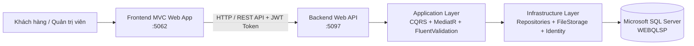

<div align="center">

# 🤵 ELEGANT SUITS - LUXURY TAILORING & E-COMMERCE SYSTEM

### ĐỒ ÁN CHUYÊN NGÀNH CÔNG NGHỆ THÔNG TIN
**Hệ thống Thương mại Điện tử May đo & Bán Suit Nam Cao Cấp Tích hợp Mô hình 3D & AI Chatbot Stylist**

[](https://dotnet.microsoft.com/)
[](https://docs.microsoft.com/en-us/dotnet/csharp/)
[](https://www.microsoft.com/sql-server)
[](https://blog.cleancoder.com/uncle-bob/2012/08/13/the-clean-architecture.html)
[](LICENSE)

---

</div>

---

## 📖 1. Giới Thiệu Dự Án

**Elegant Suits** là nền tảng thương mại điện tử chuyên biệt dành cho thương hiệu thời trang veston và âu phục nam may đo cao cấp. Hệ thống giải quyết các bài toán mua sắm trang phục trực tuyến truyền thống bằng cách kết hợp công nghệ **Tương tác Mô hình 3D (Three.js)** và **Trợ lý Ảo AI Stylist**, mang đến trải nghiệm cá nhân hóa, sang trọng và chuẩn xác cho từng khách hàng.

Dự án được xây dựng theo mô hình **Tách biệt Backend (Web API) & Frontend (MVC Web App)**, tuân thủ chặt chẽ kiến trúc **Clean Architecture** kết hợp mẫu thiết kế **CQRS (Command Query Responsibility Segregation)**, đảm bảo khả năng mở rộng, độ tin cậy và bảo trì lâu dài.

---

## ✨ 2. Các Tính Năng Nổi Bật

### 👔 Dành cho Khách Hàng (Client Portal)
- **Danh mục & Sản phẩm:** Khám phá bộ sưu tập suit, tuxedo, blazer phong phú; lọc đa tiêu chí theo danh mục, mức giá, màu sắc và sắp xếp thông minh.
- **Trình tương tác Mô hình 3D:** Xem sản phẩm dạng không gian 3D tương tác (`.glb`/`.gltf`), cho phép xoay 360 độ, phóng to chi tiết từng đường may, chất liệu vải.
- **Trợ lý Ảo AI Stylist:** Chatbot thông minh hỗ trợ tư vấn trang phục theo vóc dáng, màu da, sự kiện (tiệc cưới, công sở, dạ hội) và gợi ý phối đồ thời thượng.
- **Phòng thử đồ ảo (Virtual Try-on):** Trực quan hóa trang phục trên người mẫu ảo để chọn được mẫu suit vừa vặn nhất.
- **Giỏ hàng linh hoạt (Dual Cart Engine):**
  - Hỗ trợ giỏ hàng phiên (**Session Cart**) cho khách vãng lai chưa đăng nhập mà không bị chặn.
  - Tự động **đồng bộ (Sync)** giỏ hàng từ Session vào Database ngay khi khách hàng đăng nhập.
- **Mã giảm giá (Coupon System):** Áp dụng phiếu ưu đãi với kiểm tra tự động về số lượng, giá trị đơn tối thiểu và thời hạn hiệu lực.
- **Đặt hàng & Quản lý đơn:** Quy trình thanh toán tinh gọn (COD / Chuyển khoản); tra cứu lịch sử mua hàng, trạng thái vận chuyển và hóa đơn chi tiết.
- **Xác thực an toàn:** Đăng ký, đăng nhập tài khoản bảo mật bằng **JWT Bearer** & **Cookie Claims**; tích hợp đăng nhập nhanh qua **Google OAuth 2.0**.

### 🛡️ Dành cho Quản Trị Viên (Admin Dashboard)
- **Bảng điều khiển (Analytics & Dashboard):** Thống kê tổng quan doanh thu, số lượng đơn hàng, người dùng mới và biểu đồ xu hướng kinh doanh.
- **Quản lý Sản phẩm toàn diện:**
  - Thêm, sửa, tìm kiếm, phân trang và xem chi tiết sản phẩm.
  - Hỗ trợ tải lên hình ảnh đại diện và đính kèm **File mô hình 3D (.glb / .gltf)**.
  - Cơ chế **Xóa an toàn (Safe Soft-Delete)**: Tự động chuyển trạng thái ẩn nếu sản phẩm đã có lịch sử đơn hàng để bảo toàn dữ liệu ràng buộc.
- **Quản lý Danh mục & Phân loại:** Thiết lập và phân cấp các nhóm trang phục.
- **Quản lý Vải may đo (Fabrics & Fabric Groups):** Quản lý chất liệu cao cấp (Len Merino, Cashmere, Silk, Lanh Ý...), giá theo mét và thành phần sợi dệt.
- **Quản lý Đơn hàng:** Theo dõi trạng thái đơn (`Chờ xử lý`, `Đang giao`, `Hoàn thành`, `Đã hủy`) và trạng thái thanh toán theo thời gian thực.
- **Quản lý Khách hàng & Phân quyền (RBAC):**
  - Quản lý hồ sơ thành viên, thông tin liên lạc, lịch sử giao dịch.
  - Phân quyền vai trò động (`Administrator`, `User`).
  - Khóa (Lockout) hoặc mở khóa tài khoản vi phạm chỉ với một thao tác.
- **Quản lý Mã giảm giá (Coupons):** Tạo mã thủ công hoặc tự động sinh ngẫu nhiên, cài đặt phần trăm giảm, số lượng giới hạn, giá trị đơn tối thiểu và ngày hết hạn.

---

## 🏗️ 3. Kiến Trúc Hệ Thống (Architecture)

Hệ thống được thiết kế theo mô hình **Clean Architecture (Onion Architecture)** phân tầng rõ ràng:

```
DACN_ElegantSuits/
├── backend/
│   └── src/
│       ├── ElegantSuits.Domain/           # Entities, Enums, Exceptions, Domain Events
│       ├── ElegantSuits.Application/      # CQRS (Commands/Queries), DTOs, Interfaces, Validators
│       ├── ElegantSuits.Infrastructure/   # EF Core DbContext, Repositories, Identity, File Storage
│       └── ElegantSuits.Api/              # ASP.NET Core RESTful Web API, Controllers, Middlewares
│
├── frontend/
│   └── src/
│       └── ElegantSuits.Web/              # ASP.NET Core MVC, Razor Views, ApiClients, Session Cart
│           ├── Controllers/               # Home, Product, ShoppingCart, Order, Account, Coupon...
│           ├── Services/                  # ProductApiClient, CartApiClient, OrderApiClient...
│           ├── Views/                     # Razor Templates (Giao diện người dùng & Admin)
│           └── wwwroot/                   # CSS, JS, Images, 3D Models, Vendor Libs (Three.js...)
```

### Biểu đồ Luồng Dữ liệu (Data Flow)



---

## 🛠️ 4. Công Nghệ & Thư Viện Sử Dụng

| Tầng / Thành phần | Công nghệ / Thư viện chính |
| :--- | :--- |
| **Backend Core** | .NET 9.0, C# 13, ASP.NET Core Web API |
| **Kiến trúc & Mẫu** | Clean Architecture, CQRS, Repository Pattern, Unit of Work |
| **Thư viện CQRS** | `MediatR` (12.x), `FluentValidation.AspNetCore` |
| **Cơ sở dữ liệu & ORM** | Microsoft SQL Server, `Entity Framework Core 9.0` |
| **Bảo mật & Xác thực** | ASP.NET Core Identity, JWT (JSON Web Tokens), Google OAuth 2.0 |
| **Frontend Framework** | ASP.NET Core MVC (.NET 9.0), Razor Views |
| **Giao diện & Styling** | Bootstrap 5, FontAwesome 6, Custom Elegant Luxury Theme (Dark & Gold) |
| **Công nghệ 3D & AI** | `Three.js`, `GLTFLoader`, AI Stylist Recommendation Engine |
| **Quản lý Phiên & State** | Distributed Session, Encrypted Cookie Claims, Session Cart Manager |

---

## 🚀 5. Hướng Dẫn Cài Đặt & Chạy Dự Án

### ⚙️ Yêu cầu môi trường
- [.NET 9.0 SDK](https://dotnet.microsoft.com/download/dotnet/9.0) trở lên.
- [Microsoft SQL Server](https://www.microsoft.com/en-us/sql-server/sql-server-downloads) (SQL Server Express hoặc Developer) & [SSMS](https://learn.microsoft.com/en-us/sql/ssms/download-sql-server-management-studio-ssms).
- [Visual Studio 2022](https://visualstudio.microsoft.com/) (phiên bản 17.12+) hoặc [Visual Studio Code](https://code.visualstudio.com/).

---

### 📦 Bước 1: Clone kho lưu trữ
```bash
git clone https://github.com/KhoangrTroongs/DACN_ElegantSuits.git
cd DACN_ElegantSuits
```

---

### 🗄️ Bước 2: Cấu hình Cơ sở dữ liệu
1. Mở file cấu hình database Backend tại `backend/src/ElegantSuits.Api/appsettings.json`.
2. Kiểm tra hoặc cập nhật chuỗi kết nối phù hợp với SQL Server trên máy của bạn:
```json
{
  "ConnectionStrings": {
    "DefaultConnection": "Server=.\\SQLEXPRESS;Database=WEBQLSP;Trusted_Connection=True;MultipleActiveResultSets=true;TrustServerCertificate=True"
  }
}
```
3. Cập nhật Database bằng lệnh Entity Framework Core Migration (nếu chạy lần đầu):
```bash
dotnet ef database update --project backend/src/ElegantSuits.Infrastructure --startup-project backend/src/ElegantSuits.Api
```

---

### 🏃 Bước 3: Khởi chạy Ứng dụng

Mở 2 cửa sổ Terminal (PowerShell / Command Prompt) để chạy đồng thời Backend và Frontend:

#### Terminal 1: Chạy Backend Web API (Cổng `5097`)
```bash
dotnet run --project backend/src/ElegantSuits.Api
```
> *API Swagger UI có thể truy cập tại:* `http://localhost:5097/swagger`

#### Terminal 2: Chạy Frontend Web MVC (Cổng `5062`)
```bash
dotnet run --project frontend/src/ElegantSuits.Web
```
> *Trang chủ Website có thể truy cập tại:* `http://localhost:5062`

---

## 🔑 6. Tài Khoản Trải Nghiệm Mặc Định

Hệ thống đã chuẩn bị sẵn tài khoản quản trị để kiểm thử mọi tính năng:

| Vai trò | Email đăng nhập | Mật khẩu | Ghi chú |
| :--- | :--- | :--- | :--- |
| **Quản trị viên (Admin)** | `admin@example.com` | `Admin@123` | Truy cập toàn quyền Admin Dashboard, đơn hàng, người dùng, mã giảm giá, vải... |
| **Khách hàng mẫu** | `user1@example.com` | `User@123` | Tài khoản thành viên đã có lịch sử đặt hàng và giỏ hàng mẫu |

---

## 🌐 7. Hướng Dẫn Triển Khai Miễn Phí (Free Deployment)

Để triển khai dự án công khai lên Internet phục vụ báo cáo / demo đồ án:

### Cách 1: Sử dụng Cloudflare Tunnel (Khuyên dùng cho buổi bảo vệ đồ án)
1. Tải [Cloudflared CLI](https://github.com/cloudflare/cloudflared/releases/latest) về máy tính.
2. Chạy cả Backend và Frontend trên máy cá nhân.
3. Mở terminal và tạo đường hầm công khai HTTPS:
   ```bash
   .\cloudflared.exe tunnel --url http://localhost:5062
   ```
4. Cloudflare sẽ sinh một đường dẫn công khai (ví dụ: `https://xxx.trycloudflare.com`) để người khác truy cập vào website từ bất kỳ đâu.

### Cách 2: Triển khai lên Hosting ASP.NET (.NET 9 + MS SQL Server)
- Sử dụng gói dùng thử miễn phí của [SmarterASP.NET](https://www.smarterasp.net/) hoặc [MonsterASP.NET](https://www.monsterasp.net/).
- Publish ứng dụng bằng lệnh:
  ```bash
  dotnet publish backend/src/ElegantSuits.Api -c Release -o ./publish_api
  dotnet publish frontend/src/ElegantSuits.Web -c Release -o ./publish_web
  ```

---

## 👨‍💻 8. Thông Tin Tác Giả & Bản Quyền

- **Họ và tên:** Ngô Hữu Đức
- **Mã số sinh viên:** 2280600725
- **Trường:** Đại học Công Nghệ TP.HCM (HUTECH)
- **Đồ án:** Đồ Án Chuyên Ngành (ĐACN)
- **Email:** `ngohuuduc.it@gmail.com` / `khoangrtroongs@gmail.com`
- **GitHub:** [@KhoangrTroongs](https://github.com/KhoangrTroongs)

---

<div align="center">
  <i>Được xây dựng với niềm đam mê dành cho công nghệ và thời trang cao cấp. © 2025 - 2026 Elegant Suits.</i>
</div>